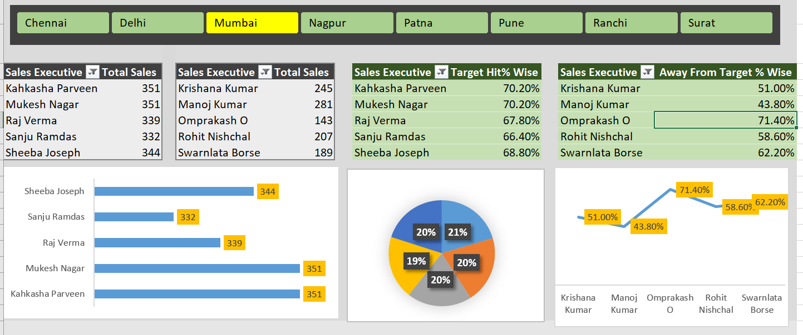

# 📊 Excel Sales Performance Dashboard

## 📌 Project Overview

This project is an interactive Sales Performance Dashboard developed in Microsoft Excel to analyze sales data across multiple cities and evaluate the performance of sales executives. The dashboard provides dynamic insights using Pivot Tables, Pivot Charts, Slicers, and KPI metrics, enabling users to monitor sales performance and make data-driven decisions.

---

## 📂 Project Files

- 📊 **Dashboard Screenshot:** [View Dashboard](./excel-dashboard.png)
- 📑 **Excel Dashboard & Dataset:** [Download Excel File](./PRO%202.xlsx)

## 🛠️ Tools & Features Used

- Microsoft Excel
- Pivot Tables
- Pivot Charts
- Slicers
- Conditional Formatting
- Data Validation
- Excel Formulas

---

## 📈 Dashboard Features

- 🌍 City-wise interactive filtering using slicers
- 💰 Top 5 Sales Executives based on Total Sales
- 📉 Bottom 5 Sales Executives based on Total Sales
- 🎯 Target Hit Percentage analysis
- 📊 Away From Target Percentage analysis
- 📋 Dynamic tables and charts that update automatically based on selected city
- 📌 KPI-focused dashboard for quick business insights

---

## 📷 Dashboard Preview

---

## 💡 Key Insights

- Compare the performance of sales executives across different cities.
- Identify the highest and lowest performing employees.
- Monitor target achievement percentages.
- Analyze how far executives are from their sales targets.
- Use interactive filters to explore city-specific performance.

---

## 📂 Files Included

- **PRO 2.xlsx** – Interactive Excel Dashboard
- **excel-dashboard.png** – Dashboard Screenshot
- **README.md** – Project Documentation

---

## 🚀 Skills Demonstrated

- Data Cleaning
- Data Analysis
- Dashboard Design
- Pivot Tables & Pivot Charts
- Interactive Reporting
- Business Intelligence
- KPI Reporting
- Data Visualization

---

## 🎯 Project Objective

To build an interactive Excel dashboard that helps businesses monitor sales performance, compare employee productivity, and evaluate target achievement through dynamic visualizations and easy-to-use filters.
